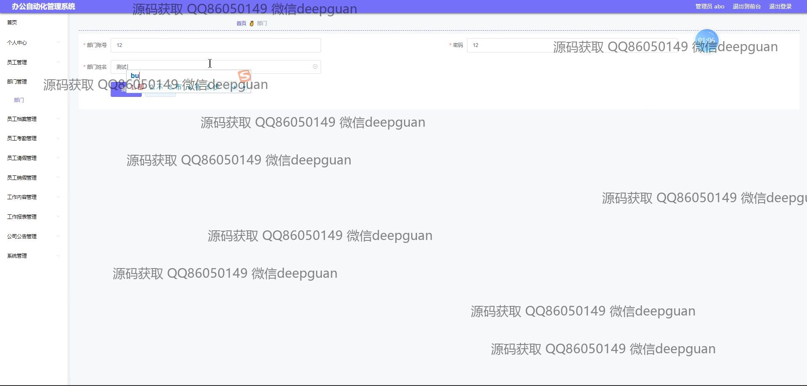

<h1 align="center">办公自动化管理系统java+vue</h1>

## 简介
办公自动化管理系统：角色分为管理员、用户；功能覆盖员工管理、部门管理、考勤与请假管理、工资管理、公文公告管理、工作日志与内容管理，提供便捷的信息化解决方案。    --计算机毕业设计源码；毕设源码；java毕业设计源码

## 联系方式

<h3 align="center">获取完整代码与数据库文件 + 微信：deepguan QQ: 86050149 QQ群: 783742310</h3>

<h3 align="center">可帮忙远程部署 包运行成功！提供远程部署、修改代码、设计文档指导、代码讲解等服务！</h3>

## 功能介绍（完整见运行截图）
管理员：基本功能包括登录、退出、导航菜单操作。可管理员工信息、部门、考勤、请假、工资、公文公告等模块。提供公司公告发布与管理、系统操作日志查看、操作权限设置，并支持员工档案管理与数据备份。支持模板上传与修改、审核状态管理、轮播图管理以及操作请求处理。提供直接访问各项管理功能的便捷途径，以确保高效的系统操作和信息更新。

员工：可以通过登录系统访问个人中心，查看和编辑个人信息，包括基本资料和工作信息。可提交或查询请假请求，查看考勤记录和工资信息。能参与部门间工作流，通过系统上传工作日志和文件以便共享与管理。可查看公司公告，参与内部信息互动，并对公告发布提供反馈选项。借助导航菜单灵活浏览各模块，增强个人工作效率，支持员工互动与协作。

## 运行截图

本代码来源于网络,仅供学习参考使用!

